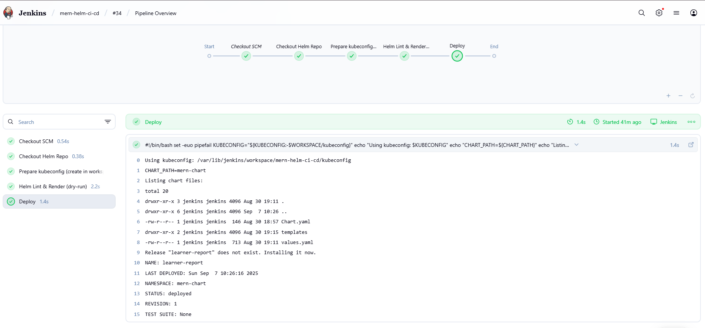

# Container Orchestration with HELM Chart of a MERN Project

- Author: U Kushal Rao
- Project: Container Orchestration with HELM Chart of a MERN Project

## Overview

This repository demonstrates building Docker images for a MERN application (separate frontend and backend), validating the application on Kubernetes using manifests and Ingress, packaging the resources into a Helm chart, and deploying the chart from Jenkins using pre-built images. The README below is a concise, production-oriented guide containing the essential commands, verification steps, and noted issues encountered during the process.

## Repository layout

```
│   .gitignore
│   Jenkinsfile
│   README.md
│   
├───K8s
│       backend-secret-template.yaml
│       backend-secret.yaml
│       backend.yaml
│       frontend.yaml
│       ingress.yaml
│       
├───mern-chart
   │   Chart.yaml
   │   values.yaml
   │   
   └───templates
           backend-deployment.yaml
           backend-secret.yaml
           backend-service.yaml
           frontend-deployment.yaml
           frontend-service.yaml
           ingress.yaml

```

## Prerequisites

- `docker` (build & push images)
- `kubectl` (v1.20+) and access to the cluster (kubeconfig)
- `helm` (v3+)
- `aws` CLI (only if using EKS and `aws eks update-kubeconfig`)
- Kubernetes cluster (EKS in this project)
- Jenkins with an agent that has `kubectl` and `helm` in PATH
- Jenkins credentials configured:
  - `kubeconfig` as Secret File (or use AWS creds and run `aws eks update-kubeconfig` in the pipeline)
  - Optional secret texts: `MONGO_URI`, `JWT_SECRET` (did not store secrets in repo)

## Build and push images

- #### Frontend
```
cd learnerReportCS_frontend
docker build -t noizy23yo/learner-report-frontend:latest .
docker push noizy23yo/learner-report-frontend:latest .
```

- #### Backend
```
cd ../learnerReportCS_backend
docker build -t noizy23yo/learner-report-backend:latest .
docker push noizy23yo/learner-report-backend:latest .
```

## Quick Kubernetes manifest test (manual)

Apply manifests to validate before converting to Helm:
```
kubectl apply -f frontend.yaml
kubectl apply -f backend.yaml
kubectl apply -f backend-secret.yaml
kubectl apply -f ingress.yaml
```
After applying to check pods,services
```
kubectl get all
```
- *Screenshot: *
<p align="center">
  
</p>

<br>

Used port-forward for backend:
```
kubectl -n port-forward svc/backend-service 3001:3001
```


## Helm chart deployment
Chart located at mern-chart/. Use full image strings when setting images.

```
helm install mern-app ./mern-chart

helm template learner-report mern-chart \
  --values mern-chart/values.yaml \
  --set frontend.image=<FRONTEND_IMAGE> \
  --set backend.image=<BACKEND_IMAGE> \
  --namespace <NAMESPACE> --debug > /tmp/rendered.yaml

helm upgrade --install learner-report mern-chart \
  --namespace <NAMESPACE> --create-namespace \
  -f mern-chart/values.yaml \
  --set frontend.image=<FRONTEND_IMAGE> \
  --set backend.image=<BACKEND_IMAGE> \
  --wait --timeout 3m
```

- *Screenshot: Successfull local deployment*
<p align="center">
  
</p>

<br>


## Jenkins deploy stage (pipeline with SCM file)

This Jenkins stage assumes `kubeconfig` is stored in Jenkins as a Secret File and FRONTEND_IMAGE / BACKEND_IMAGE are provided as parameters.
```
stage('Deploy') {
  steps {
    sh '''#!/bin/bash
      set -euo pipefail
      KUBECONFIG="${KUBECONFIG:-$WORKSPACE/kubeconfig}"
      echo "Using kubeconfig: $KUBECONFIG"
      echo "CHART_PATH=${CHART_PATH}"
      echo "Listing chart files:"
      ls -la "${CHART_PATH}" || true

      # Use the chart's values.yaml explicitly
      VALUES_FILE="${CHART_PATH}/values.yaml"
      if [ ! -f "${VALUES_FILE}" ]; then
      echo "ERROR: ${VALUES_FILE} not found!"
      exit 1
      fi

        helm upgrade --install learner-report "${CHART_PATH}" \
          -n "${CHART_PATH}" \
          -f "${VALUES_FILE}" \
          --set frontend.image="${FRONTEND_IMAGE}" \
          --set backend.image="${BACKEND_IMAGE}"
    '''
  }
}

```
- *Screenshot: Jenkins pipeline success:*
<p align="center">
  
</p>

<br>

- *Screenshot: EKS health check :*
<p align="center">
  
</p>

<br>

- *Screenshot: Working Frontend :*
<p align="center">
  
</p>

<br>

- *Screenshot: Backend health check :*
<p align="center">
  
</p>

<br>

## Challenges Encountered and Resolutions

- **kubectl failed with AWS exec plugin**  
  - *Cause*: kubeconfig used AWS exec plugin but `aws` CLI was missing or credentials not configured.  
  - *Resolution*: Installed AWS CLI v2 on the agent, configured credentials using `aws configure`, and either ran `aws eks update-kubeconfig` or stored a working kubeconfig as a Jenkins Secret File.

- **Helm template errors or missing `.Values` keys**  
  - *Cause*: Templates referenced absent keys or had stray placeholders.  
  - *Resolution*: Added required keys in `values.yaml`, removed unused placeholders, and validated with `helm lint` and `helm template` before install.

- **Secrets management**  
  - *Cause*: Secrets were initially placed directly in values files.  
  - *Resolution*: Used Jenkins secret-text credentials and created Kubernetes Secrets at deploy time; referenced them via `env.valueFrom.secretKeyRef`.

- **Ingress not responding**  
  - *Cause*: Ingress controller was missing, or service/path configuration was incorrect.  
  - *Resolution*: Installed an ingress controller (NGINX or AWS ALB), verified ingress status (IP/hostname), and ensured service names matched.

- **Image pull failures**  
  - *Cause*: Nodes lacked registry authentication or image names were incorrect.  
  - *Resolution*: Ensured nodes had access to the registry with valid credentials (`imagePullSecrets`, ECR auth, or used public images).


